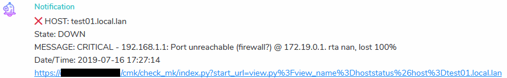

# sendtomatrix

Linux shell script to send a (multiline) message to a [matrix room](https://matrix.org) hosted on a [synapse server](https://github.com/matrix-org/synapse).

Usable for e.g. cronjobs, nagios notifications or ci pipelines.

## Usage

This script expects data to be piped in on STDIN.

```bash
COMMAND | sendtomatrix [OPTION]
```

## Options

* -u Matrix User Name
* -p Matrix User Password
* -a Matrix Access Token
* -s Matrix Server FQDN
* -r Matrix RoomID
* -f Optional configuration file
* -h Show help message

You can either provide an access token or username / password.
If no access token is provided, this script will get one for you from the server.

But keep in mind, that every time this script runs without an access token, a new access token is created and fills up your device list.
With to many devices in your device list, there is a potential getting blacklisted.

The recommended way is to provide an access token.

### Getting an access token from the server

```bash
curl -s -X POST -d '{ "type":"m.login.password", "user":"$MATRIX_USER", "password":"$MATRIX_PASS" }' "https://$MATRIX_SERVER/_matrix/client/r0/login" | jq -r '.access_token'
```

### Examples

```bash
echo "Testmessage 1" | sendtomatrix -f /etc/sendtomatrix.conf
echo "Testmessage 2" | sendtomatrix -f /etc/sendtomatrix.conf -r "\!QtykxKocfZaZOUrTwp:matrix.org"
```

Please keep an eye on the format of the RoomID!

## Requirements

* [Synapse server](https://github.com/matrix-org/synapse) as API endpoint
* jq on the system which runs the script
* Before you can send a message to a room, the user sending the message already needs to have joined it

## Configuration file

The configuration file can contain the following values:

```bash
MATRIX_USER=TestUser
MATRIX_PASS=TestPassword
MATRIX_ACCESS_TOKEN=MD..blah
MATRIX_SERVER=matrix.org
# RoomID from the #matrix:matrix.org Channel
MATRIX_ROOM_ID="!QtykxKocfZaZOUrTwp:matrix.org"
```

These values can be overriden by command line parameters.

## Cron Job

It's also possible to use this script to send the output of a cronjob to a matrix room.

Example:

```bash
SHELL=/bin/bash
0 4 * * * root /usr/local/sbin/random_script | sendtomatrix -f /etc/sendtomatrix.conf
0 5 * * * OUTPUT="# $(hostname -f) - random_script" && OUTPUT="$OUTPUT\n" && echo -e "$OUTPUT" | sendtomatrix -f /etc/sendtomatrix.conf
```

The last example allows appending e.g. the fqdn of the server and custom text to a message.

With this approach it's possible to send the same message from different servers to the same room and still be able to keep track from which server the message originates.

## Nagios / Icinga / Check_MK Integration

The sendtomatrix-wrapper-nagios script is an example notification script for nagios compatible monitoring systems.

It requires an installed and configured sendtomatrix script because it just formats and then pipes a message to it.

In check_mk it can be used as is. If you wand to use it with other monitoring cores you maybe need to adjust the variables.


